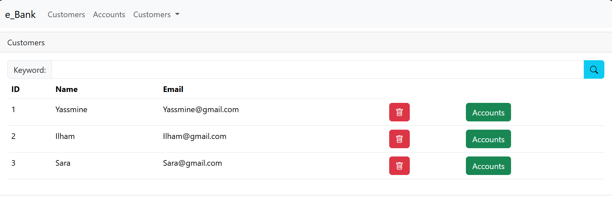
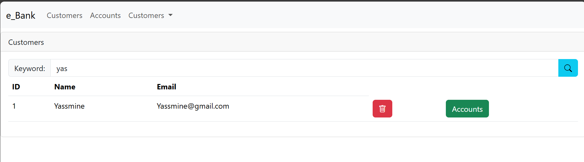
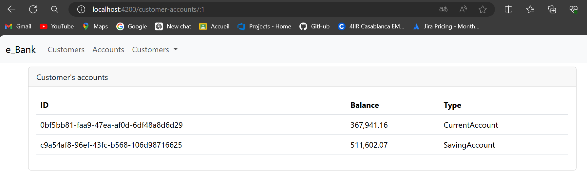
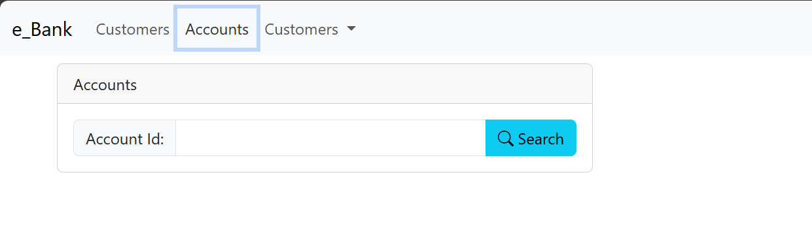
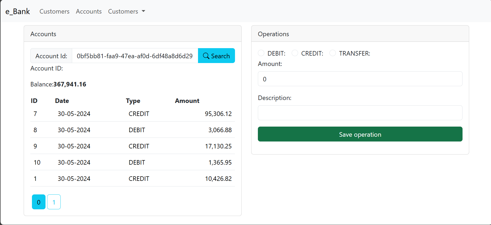
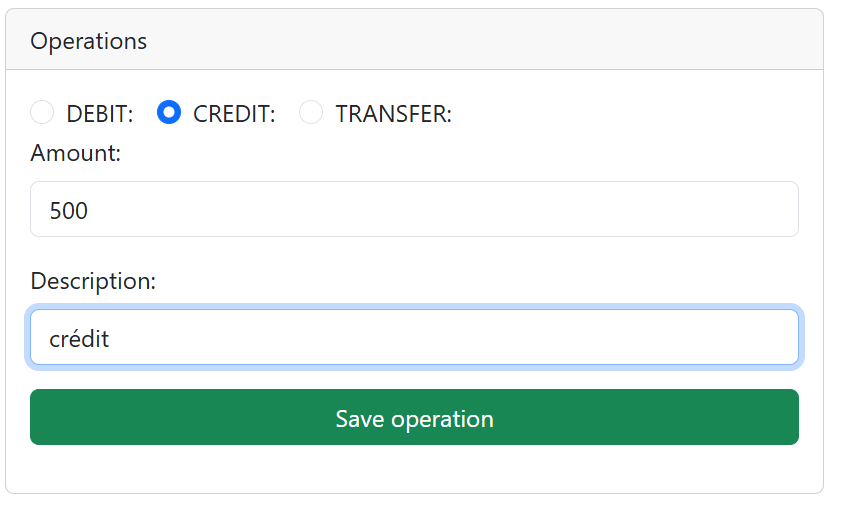
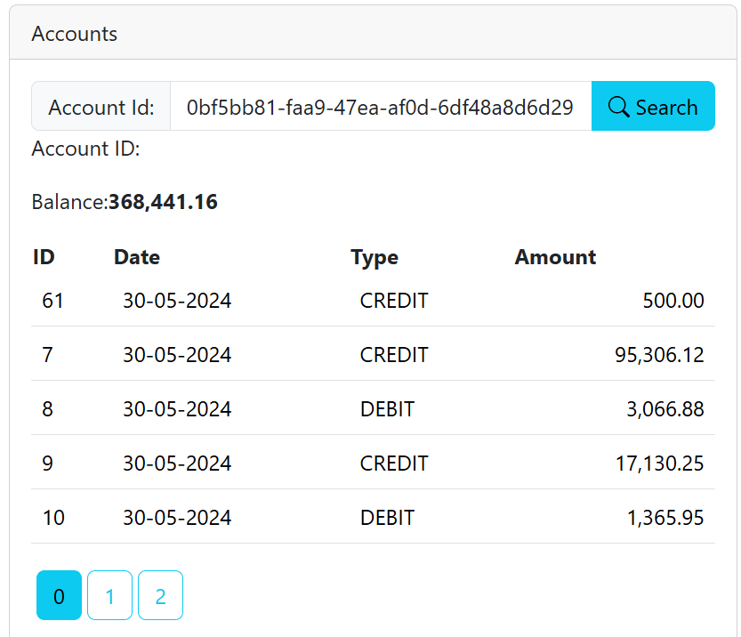
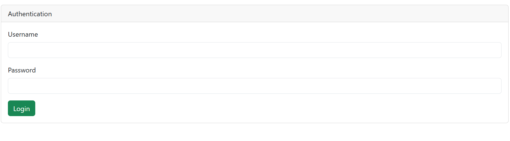

<h1>Compte rendu du projet e_banking Frontend</h1>
<h1>Introduction</h1>

Après avoir développé avec succès le backend de notre application e_banking basée sur Spring, nous avons entrepris la construction du frontend en utilisant le framework Angular. Ce compte rendu détaille les composants, les services, les modèles et les aspects de sécurité implémentés dans le frontend pour assurer une expérience utilisateur sécurisée et efficace.

<h1>Composants Angular</h1>

Le frontend du projet e_banking développé avec Angular comprend plusieurs composants essentiels. Le composant Accounts permet aux utilisateurs de gérer les détails et les opérations sur les comptes bancaires. Customers affiche la liste des clients avec des options de recherche et de gestion des comptes associés. Customer-Account se concentre sur les détails spécifiques des comptes clients. Navbar facilite la navigation, New-Customer gère l'ajout de nouveaux clients, et Login assure l'authentification sécurisée. AdminTemplate et NotAuthorized dirigent respectivement les administrateurs et les utilisateurs non autorisés vers les pages appropriées.

<h1>Services Angular</h1>

Les services Angular du projet e_banking jouent des rôles clés dans la gestion des fonctionnalités essentielles de l'application. Le Account Service offre des méthodes pour effectuer des opérations bancaires telles que le débit, le crédit, les transferts et la consultation de soldes. Le Customer Service permet la gestion complète des clients, incluant l'ajout, la mise à jour et la suppression des informations clients. Enfin, l'Authentication Service centralise la gestion de l'authentification utilisateur, facilitant les opérations de connexion et de déconnexion, ainsi que le chargement sécurisé des profils utilisateurs et des tokens JWT à partir du local storage. Ces services garantissent une expérience utilisateur fluide et sécurisée tout au long de l'utilisation de l'application e_banking.

<h2>Modèles Angular</h2>

Le modèle Customer est conçu pour encapsuler les données essentielles d'un client dans l'interface utilisateur de l'application e_banking. Il contient des attributs tels que le nom, prénom, adresse et autres informations pertinentes qui permettent de gérer et d'afficher de manière structurée les détails des clients dans les différents composants et services de l'application.

<ul>
<li>

Rechercher un customer à partir d'un mot clé:

Consulter les comptes d'un customer

</li>
</ul>

Le modèle Account est utilisé pour représenter les informations spécifiques à un compte bancaire dans l'interface utilisateur. Il inclut des propriétés comme le numéro de compte, le solde actuel, le type de compte (courant ou épargne), ainsi que d'autres données relatives aux opérations bancaires telles que les transactions de débit et de crédit. Ce modèle est crucial pour assurer une visualisation précise et une gestion efficace des comptes bancaires à travers les différentes fonctionnalités offertes par l'application.

<ul>
<li>
Accounts

Details d'un compte recherché

Opération de crédit

Search

Login

</li>
</ul>
<h1>Introduction</h1>

L'objectif de cette partie du projet est de sécuriser l'application frontend développée en Angular à l'aide d'un système d'authentification basé sur JSON Web Token (JWT) et Spring Security côté backend. Ce compte rendu détaille les mesures prises pour assurer la sécurité de l'application.

<h1>Technologies utilisées</h1>
<ul>
<li>
JSON Web Token (JWT) : Méthode standard pour sécuriser les échanges de données entre le frontend et le backend.
Spring Security : Framework de sécurité utilisé côté backend pour gérer l'authentification et l'autorisation.

</li>
</ul>
<h1>Mise en œuvre de la sécurité dans l'application frontend</h1>
<h1>Authentification utilisateur</h1>
<ul>
<li>
Interface utilisateur de connexion :

Une page de connexion a été développée pour permettre aux utilisateurs de saisir leurs informations d'identification (nom d'utilisateur et mot de passe).
Service d'authentification :

Un service Angular a été créé pour gérer les requêtes d'authentification vers le backend.
Ce service envoie les informations d'identification à l'API RESTful backend via une requête HTTP POST sécurisée.
</li>
</ul>
<h1>Gestion des tokens JWT</h1>
<ul>
<li>
Réception et stockage du token JWT :

Une fois l'utilisateur authentifié avec succès, le frontend reçoit un token JWT du backend.
Ce token est stocké de manière sécurisée dans le navigateur du client, généralement dans le localStorage ou sessionStorage.
Utilisation du token JWT :

À chaque requête subséquente nécessitant une autorisation, le token JWT est ajouté aux en-têtes de la requête HTTP.
Cela permet au backend de vérifier l'identité de l'utilisateur et de lui accorder ou non l'accès aux ressources demandées.
</li>
</ul>
<h1>Gestion de la déconnexion</h1>
<ul>
<li>
Déconnexion utilisateur :
Une fonctionnalité de déconnexion a été implémentée pour permettre aux utilisateurs de se déconnecter proprement de l'application.
Lors de la déconnexion, le token JWT est supprimé du localStorage pour empêcher l'accès non autorisé aux ressources backend.
</li>
</ul>
<h1>Sécurisation des routes</h1>
<ul>
<li> 
Garde de route (Route Guard) :
Des gardes de route (route guards) ont été mis en place pour protéger les routes sensibles de l'application.
Ces gardes de route vérifient la présence du token JWT dans le localStorage avant de permettre l'accès à une route particulière.
</li>
</ul>
<h1>Conclusion</h1>

La sécurisation de l'application frontend avec JSON Web Token (JWT) et Spring Security côté backend offre une couche de sécurité robuste pour protéger les données sensibles et les fonctionnalités de l'application. En implémentant ces mesures, nous assurons une expérience utilisateur sécurisée tout en respectant les meilleures pratiques de développement d'applications web modernes.

